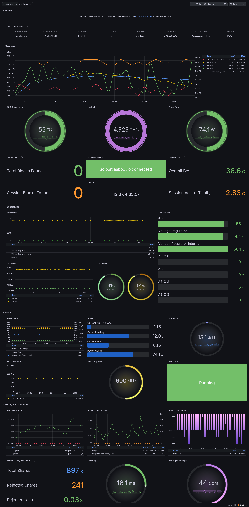

# Grafana dashboard

[`nerdqaxe-exporter.json`](nerdqaxe-exporter.json) is a Grafana dashboard for
the metrics exposed by nerdqaxe-exporter.

    

## Requirements

- Grafana 12 or newer. The dashboard is saved in the v2 schema
  (`dashboard.grafana.app/v2`), which older versions cannot import.
- A Prometheus datasource scraping nerdqaxe-exporter.

## Import

In Grafana, go to *Dashboards* > *New* > *Import*, upload
`nerdqaxe-exporter.json`, and select the folder to save it in.

Two variables drive the dashboard:

- *Datasource* selects the Prometheus datasource every panel queries, so the
  dashboard carries no datasource of its own.
- *Device hostname* lists the devices found in `nerdqaxe_info`, and every panel
  filters on it, so one dashboard serves as many devices as you scrape.

## Panels

| Row | Content |
| --- | --- |
| Header | Device identity from `nerdqaxe_info`: model, ASIC model and count, IP, firmware version and SSID |
| Overview | Hashrate, ASIC temperature, power draw, pool connection, best difficulty, blocks found and uptime |
| Temperatures | Board and ASIC temperatures, fan speed in RPM and as a fraction of maximum |
| Power | Power trend, voltages and currents, efficiency in J/TH, ASIC frequency and status |
| Mining Pool & Network | Share rate, accepted and rejected shares, pool ping RTT and loss, WiFi signal strength |
